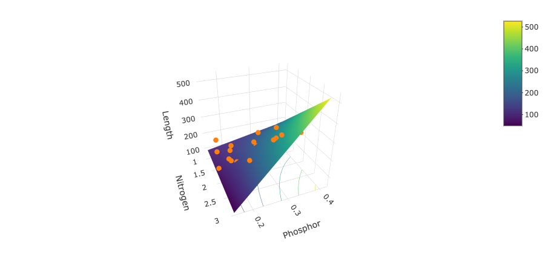

```{r include = FALSE}
CWD <- read.table("./datasets/01-linear-regression/christ.csv", header = T, sep = ",", dec = ".")
attach(CWD)

model <- lm(CWD.BASA ~ RIP.DENS)
model3 <- lm(I(log(CWD.BASA)) ~ RIP.DENS + I(RIP.DENS^2))
summary(model)
confint(model)

needles <- read.table("./datasets/01-linear-regression/needles.txt", header = T, sep = "\t", dec = ".")
attach(needles)

```

## Example: Mineral composition versus growth

::::::: {.cols data-latex=""}
:::: {.col data-latex="{0.75\textwidth}"}
- Case study: 26 8-year-old Japanese larches
- **Goal**: study association between height $Y$ of tree (in cm) and mineral composition of needles:
  - Nitrogen $X_N$
  - Phosphorus $X_P$
  - Potassium $X_K$
  - Residual ash $X_r$
- Independent variables expressed in percentage observed in dried needles.
::::

:::: {.col data-latex="{0.05\textwidth}"}
\mbox{}
::::
:::: {.col data-latex="{0.2\textwidth}"}

\scriptsize
Image source: [Wikipedia](https://en.wikipedia.org/wiki/Larix_kaempferi).
::::
:::::::


## Simple linear regression not possible

- Separate linear regression models
\[
  E(Y|X_P)=\alpha+\beta_P X_P
\]
only allow to predict based on 1 mineral.
- More accurate predictions based on all minerals simultaneously.
- Separate models might \alert{not} show \alert{pure effect}
  - $\beta_P$ is mean difference in length between trees that differ 1 unit in proportion phosphorus.
  - \alert{Confounding}: even if phosphorus would not have influence on length, trees with higher level of phosphorus might be taller because they contain, for example, more potassium.
  - Necessity to compare trees with different level of phosphorus, but same level of potassium.

## Multiple linear regression

- Assume that 
\[
  E(Y|X_N,X_P,X_K,X_r)=\alpha + \beta_N X_N+ \beta_P X_P + \beta_K X_K +\beta_r X_r
\]
for unknown \alert{intercept} $\alpha$ and \alert{slopes} $\beta_N, \beta_P, \beta_K, \beta_r$.

- Now prediction based on multiple minerals possible.
- Confounding \alert{partially circumvented}: 
\begin{eqnarray*}
&&E(Y|X_N,X_P=x_P+\delta,X_K,X_r)-E(Y|X_N,X_P=x_P,X_K,X_r)\\
&&=\alpha + \beta_N X_N + \beta_P (x_P+\delta)+ \beta_K X_K +\beta_r X_r\\
&&\hspace*{1cm}-\alpha - \beta_N X_N- \beta_P x_P- \beta_K X_K -\beta_r X_r = \beta_P\delta
\end{eqnarray*}
$\beta_P=$ difference in mean length between trees that differ 1 unit in proportion phosphorus, but have **same value for other explaining variables**.

## Analysis of larches

```{r eval = FALSE}
model_l <- lm(length ~ phosphor)
summary(model_l)
```

We call in this case the association between phosphorus and length **unadjusted**.

## Analysis of larches

\footnotesize
```{r echo = FALSE}
model_l <- lm(length ~ phosphor)
summary(model_l)
```

## Analysis of larches

Parameters estimated using least squares method:

\small
```{r eval = FALSE}
model_l2 <- lm(length ~ nitrogen + phosphor 
               + potassium + residu)
summary(model_l2)
```
```{r echo = FALSE}
model_l2 <- lm(length ~ nitrogen + phosphor + potassium + residu)
summary(model_l2)$coefficients
```

\normalsize
We say in this case that the association between phosphorus and length is **adjusted** for nitrogen, potassium, and residual ash.

## Tests and confidence intervals 

- Tests and confidence intervals for parameter $\beta$ based on
\[
  \frac{\hat{\beta}-\beta}{SE(\hat{\beta})}\sim t_{n-p}
\]
with $p$ number of unknown parameters in model.
- Or directly using
```{r eval = FALSE} 
confint(model_l2)
```

## Analysis of larches 
\small
```{r echo = FALSE}
summary(model_l2)$coefficients
```
\normalsize

- **95\% CI** for $\beta_N$ needs $t_{21,0.975}=2.08$
\[
  [97.76 \pm 2.08\times 24.57]=[46.66, 148.86].
\]
- **95\% CI** for $\beta_P$
\[
  [256.97 \pm 2.08\times 169.91]=[-96.36, 610.31].
\]


## Analysis of larches: individual residual plots

```{r echo = FALSE}
par(mfrow = c(2,2))
plot(nitrogen, resid(model_l2))
lines(lowess(nitrogen,resid(model_l2)))
plot(phosphor, resid(model_l2))
lines(lowess(phosphor,resid(model_l2)))
plot(potassium, resid(model_l2))
lines(lowess(potassium,resid(model_l2)))
plot(residu, resid(model_l2))
lines(lowess(residu,resid(model_l2)))
```

## Analysis of larches: residual plots

```{r echo = FALSE}
par(mfrow=c(2,2))
plot(model_l2)
```

## Interaction or effect modification

- **Interaction** or **effect modification**: effect of variable $X$ on outcome $Y$ depends on third variable $Z$.
- Examples:
  - Effect of nitrogen on growth depends on proportion phosphorus
  - Pharmacogenetics: effect of steroids for asthma on lung function depends on certain genes.
  - Gene-environment interactions: effect of certain genes on COPD depends on history of smoking.
- Model interactions through **cross-product term**:
\[
  E(Y|X_N,X_P)=\alpha + \beta_N X_N+ \beta_P X_P+ \beta_{NP} X_NX_P.
\]

## Interpretation

\begin{align*}
E(Y| & X_N=x_N+1,X_P)-E(Y|X_N=x_N,X_P)\\
 &=\alpha + \beta_N (x_N+1)+ \beta_P X_P+ \beta_{NP} (x_N+1)X_P\\
 &\hspace*{1cm}-\alpha - \beta_N x_N- \beta_P X_P- \beta_{NP} x_N X_P\\
 &=\beta_N+\beta_{NP}X_P.
\end{align*}

- $\beta_{NP}$ is difference in nitrogen \alert{effect} between trees that differ 1 percentage in phosphorus.
- Decide whether nitrogen effect depends on quantity phosphorus can be done by testing if $\beta_{NP}=0$.
- $\beta_N$ is effect of 1 percentage increase in nitrogen when percentage phosphorus is 0.


## Analysis of larches with interaction

```{r eval = FALSE}
model_l3 <- lm(length ~ nitrogen * phosphor)
summary(model_l3)
```

## Analysis of larches with interaction

\scriptsize
```{r echo = FALSE}
model_l3 <- lm(length ~ nitrogen * phosphor)
summary(model_l3)
```

## Predicted association (full model, interaction)



Interactive visualization at 
\url{https://shiny-stats.fly.dev/multi-regression/}

## Predicted association (left) and effect (right)

```{r, echo=FALSE, fig.height=6}
model <- lm(length ~ nitrogen*phosphor, data = needles)
cs <- coef(model)

nitrogen_plot <- seq(1, 3, length.out = 50)
phosphor_plot <- c(0.15, 0.20, 0.25, 0.30)

predict_length <- function(phosphor) {
  length <- cs[1] + cs[2]*nitrogen_plot + cs[3]*phosphor + cs[4]*nitrogen_plot*phosphor
  return(length)  
}

par(mfrow=c(1, 2))
plot(1, type='n', xlim=c(min(nitrogen_plot), max(nitrogen_plot)),
     ylim=c(100, 300), xlab='Nitrogen', ylab='Length',
     main="Nitrogen-length association")
for (ph in phosphor_plot) {
  outcome <- predict_length(ph)
  lines(nitrogen_plot, outcome, type = "l", lwd = 2)
}

# manually place labels
text(2.55, 150, 0.15, adj = 0)
text(2.55, 200, 0.20, adj = 0)
text(2.55, 250, 0.25, adj = 0)
text(2.10, 280, 0.30, adj = 0)

phosphor_plot <- seq(0.15, 0.40, by = 0.1)
nitrogen_effect <- cs[2] + cs[4]*phosphor_plot
plot(phosphor_plot, nitrogen_effect, type = "l", lwd = 2,
     xlab = "Phosphorus", ylab = "Nitrogen effect",
     main = "Influence of one unit of nitrogen")
```


## Analysis of larches without interaction

```{r eval = FALSE}
model_l4 <- lm(length ~ nitrogen + phosphor)
summary(model_l4)
```

## Analysis of larches without interaction

\scriptsize
```{r echo = FALSE}
model_l4 <- lm(length ~ nitrogen + phosphor)
summary(model_l4)
```

## Predicted association (full model, no interaction)


## Predicted association (left) and effect (right)

```{r, echo=FALSE, fig.height=6}
model <- lm(length ~ nitrogen + phosphor, data = needles)
cs <- coef(model)

nitrogen_plot <- seq(1, 3, length.out = 50)
phosphor_plot <- c(0.10, 0.20, 0.30, 0.40)

predict_length <- function(phosphor) {
  length <- cs[1] + cs[2]*nitrogen_plot + cs[3]*phosphor
  return(length)  
}

par(mfrow=c(1, 2))
plot(1, type='n', xlim=c(min(nitrogen_plot), max(nitrogen_plot)),
     ylim=c(100, 300), xlab='Nitrogen', ylab='Length',
     main="Nitrogen-length association")
for (ph in phosphor_plot) {
  outcome <- predict_length(ph)
  lines(nitrogen_plot, outcome, type = "l", lwd = 2)
}

# manually place labels
text(2.35, 150, 0.10, adj = 0)
text(2.07, 177, 0.20, adj = 0)
text(1.79, 203, 0.30, adj = 0)
text(1.50, 230, 0.40, adj = 0)

phosphor_plot <- seq(0.15, 0.40, by = 0.1)
nitrogen_effect <- cs[2] + 0*phosphor_plot
plot(phosphor_plot, nitrogen_effect, type = "l", lwd = 2,
     xlab = "Phosphorus", ylab = "Nitrogen effect",
     main = "Influence of one unit of nitrogen")
```

## Constructing statistical models

Statistical models are built hierarchically by adding or removing one predictor at a time:

- **Forward** model construction: starts from empty model.
- **Backward** model construction: starts from full model, i.e., one that contains all available predictors.
- **Stepwise** model construction: combination of both.


## Constructing statistical models

**Forward** model construction:

- Include predictors \alert{1 by 1}
- After each inclusion:
  - Verify if certain predictors in the model are no longer significantly associated with outcome.
  - Remove those \alert{1 by 1} until model contains only significant predictors.
- Repeat until no inclusion is significant

**Backward** model construction: 

- Exclude \alert{1 by 1} the **nonsignificant** predictors.
- Until model only contains significant predictors.

In either case, the included (excluded) predictor is ideally the one that is most (least) strongly associated with outcome, after verification for the other predictors in the model.


## Constructing statistical models

- Once all **first order terms** have been verified, investigate **higher order terms** (interactions, quadratic effects, ...)
- This is **not** done in exhaustive way:
  - Because number of higher order terms can get very large.
  - Because \alert{problem of multiple testing} might sometimes lead relatively easy by mere coincidence to incorrect conclusion that certain higher order term is significant.

- Higher order terms considered for inclusion based on:
  - Biological judgment
  - Insight from residual plots.

- Once final model is obtained, verify through residual plots.


## Analysis of larches: provisonally `final' model

\small
```{r}
model_l5 <- lm(length ~ nitrogen * phosphor + potassium 
               + phosphor * residu)
```
```{r echo = FALSE}
summary(model_l5)$coefficients
```

\begin{verbatim}
Residual standard error: 33.43 on 19 degrees of freedom
Multiple R-squared:  0.9069,	Adjusted R-squared:  0.8774 
F-statistic: 30.83 on 6 and 19 DF,  p-value: 8.159e-09
\end{verbatim}

## Constructing statistical models


- How to build statistical models \alert{depends ideally from goal} of these models:
  - Making predictions
  - Determining effect of an exposure on an outcome.

- To make predictions, previous strategy is sensible since it aims at avoiding overfitting.
- To determine effect of an exposure on an outcome, must make sure above all to adjust for all \alert{confounders}
- Recall: Confounder are factors
  - that are not comparable between exposure groups
  - in particular, that are associated with outcome and exposure, but are \alert{not influenced by either}.

