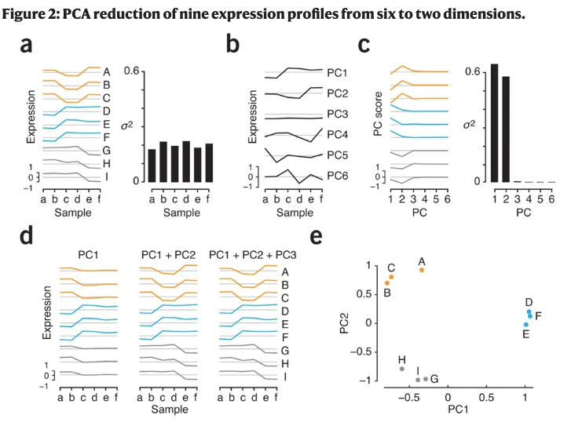
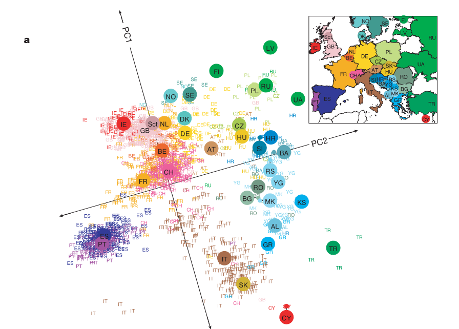
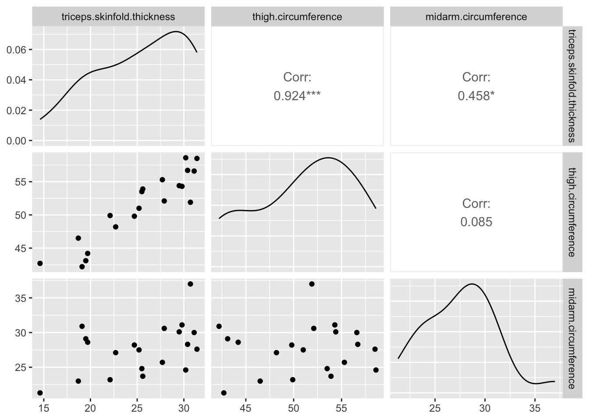
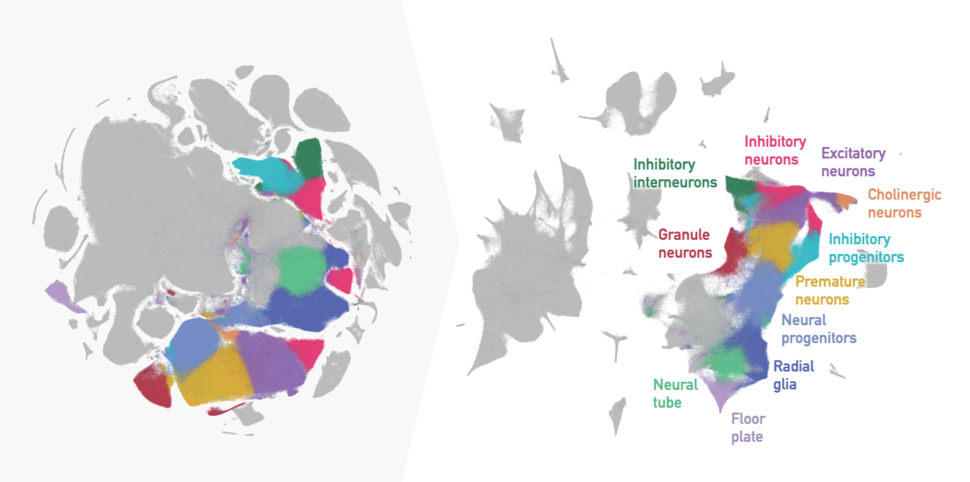

# What is dimensionality reduction?

## What and why

- Reduce the number of variables ("dimensionality") in a dataset **in a principled way**.
- Useful for
  - Visualization
  - Data preprocessing
  - Computational efficiency
- Many different approaches
  - Principal component analysis (this course)
  - Multidimensional scaling
  - t-SNE, UMAP, ...

## Visualization

\centering
{height=75%}

From: Lever et al., *Principal component analysis*, Nature Methods, Vol. 14, p. 641–642, 2017.

## Visualization

Genotype data 197,146 loci in 1387 Europeans, summarized in two principal components (left) and compared to geographical origin (right).

\centering
{height=50%}

From: Novembre et al., *Genes mirror geography within Europe*, Nature, Vol. 456, 6 November 2008.

## Data preprocessing

Bodyfat dataset:

- Suffered from high multicollinearity.
- Conclusions from regression model are doubtful.

\centering
{height=50%}

## Computational efficiency

- A 250 x 250 image consists of 250$^2$ = 62,500 pixels.
- Not all pixels are equally informative.
- Extract signal that is maximally informative, discard rest.

\centering

## Principal component analysis

- Covered in this course.
- Works by finding directions in which **variance is maximized**.
- Good first choice, not so good if patterns are highly nonlinear.

\centering
{height=50%}

## Other dimensionality reduction methods

t-SNE, UMAP:

- Useful for highly nonlinear relations between features.
- "Deforms" data so that local structure is maintained.
- Frequently used in single-cell RNA sequencing analysis.

From: \url{https://www.cancer.gov/ccg/blog/2020/interview-t-sne}
