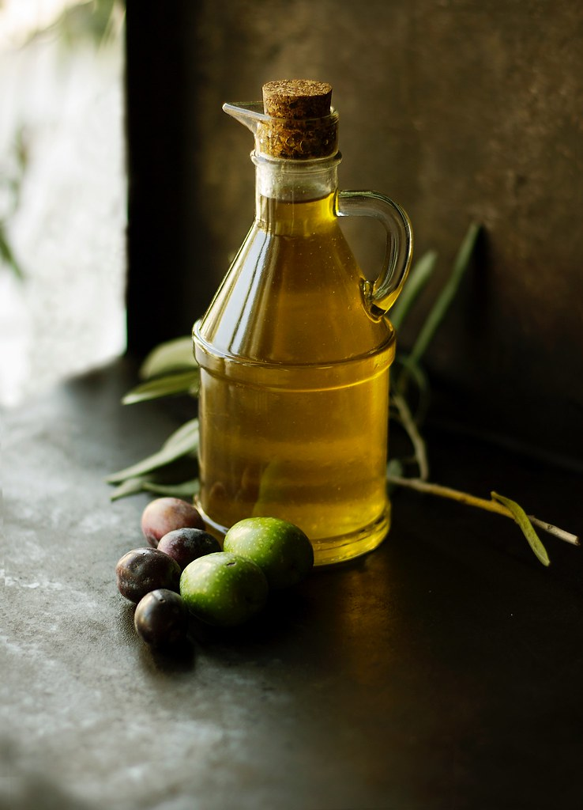
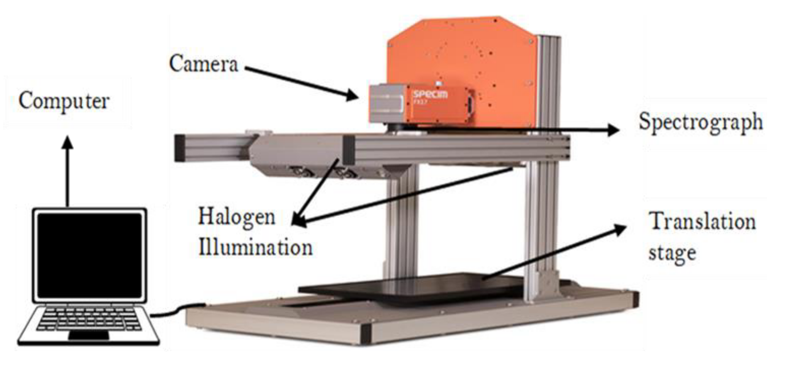
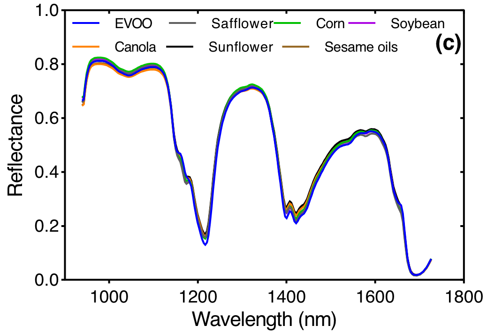
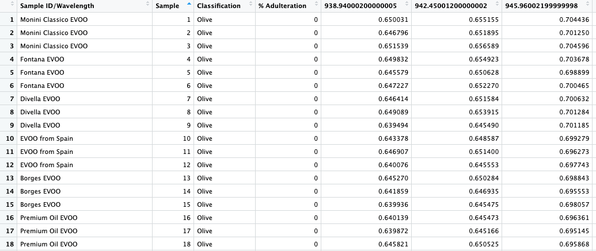

```{r, include=FALSE}
set.seed(1234)

library(tidyverse)
library(readxl)
library(pls)
library(loon.data)
theme_set(theme_bw() + theme(text = element_text(size = 14)))

# Read oils data
oils <- read_excel("./datasets/02b-pca-applications/HSI.xlsx")
cols <- colnames(oils)
spectra <- cols[5:length(cols)]

oils_long <- oils %>%
  pivot_longer(cols = spectra,
               names_to = "wavelength",
               values_to = "intensity") %>%
  mutate(wavelength = as.numeric(wavelength))

# PCA on spectral data
pca_oils <- oils %>%
  select(all_of(spectra)) %>%
  prcomp(scale = FALSE)

# Train/test split for adulterated oils
adulterated <- oils %>%
  filter(`% Adulteration` > 0, `% Adulteration` <= 20) %>%
  select(-`Sample ID/Wavelength`, -Sample, -Classification)

train_no <- round(0.8 * nrow(adulterated))
train_idxs <- sample(1:nrow(adulterated), train_no)
adulterated_train <- adulterated[train_idxs, ]
adulterated_test <- adulterated[-train_idxs, ]

# Build PCR and PLS models
pcr_model <- pcr(
  `% Adulteration` ~ ., data = adulterated_train,
  scale = FALSE, validation = "CV", ncomp = 10
)
pls_model <- plsr(
  `% Adulteration` ~ ., data = adulterated_train,
  scale = FALSE, validation = "CV", ncomp = 10
)

# Faces dataset
data(faces)
pc_olivetti <- prcomp(faces)

show_image <- function(imgdata, title = NULL) {
  m <- matrix(imgdata, nrow = 64, ncol = 64, byrow = F)
  m <- t(apply(m, 2, rev))
  image(m, axes = FALSE, col = grey(seq(0, 1, length = 256)),
        main = title)
}

normalize <- function(x) {
  255 * (x - min(x)) / (max(x) - min(x))
}

project_data <- function(pc, n_retain) {
  t(t(pc$x[, 1:n_retain] %*% t(pc$rotation)[1:n_retain, ]) + pc$center)
}

```

## Examples

1. Adulteration of olive oil
  - Malavi, Derick, Amin Nikkhah, Katleen Raes, and Sam Van Haute. 2023. "Hyperspectral Imaging and Chemometrics for Authentication of Extra Virgin Olive Oil: A Comparative Approach with FTIR, UV-VIS, Raman, and GC-MS.” Foods 12 (3): 429. \url{https://doi.org/10.3390/foods12030429}
2. Human faces dataset
  - \url{https://scikit-learn.org/0.19/datasets/olivetti_faces.html}
  
# Adulteration of olive oil

## Problem setting

:::: {.columns}

::: {.column width="50%"}

Extra virgin olive oil (EVOO):
\vspace*{0.5cm}

- High quality
- Flavorful
- Health benefits
- **More expensive** (than regular oil)

\vspace*{1cm}
To reduce cost, EVOO is often **adulterated** with other, cheaper food oils.

:::

::: {.column width="50%"}
{height=2in fig-align=center}
:::
::::

## Research questions

1. **Classification:** Can we detect whether a given EVOO sample has been adulterated?
    - Yes/no answer (categorical)
2. **Regression:** Can we detect the degree of adulteration?
    - Continuous answer, from 0% (no adulteration) to 100%

## Hyperspectral imaging (HSI)

{fig-align=center height=50%}

- Measures reflected infrared light (700-1800 nm) off sample
- Provides a non-destructive way of testing sample


## Hyperspectral "images" (spectra)

{fig-align=center height=50%}

- HSI measures reflectance at 224 wavelengths from 700 to 1800 nm
- Reflectance at given wavelength is determined by molecular features of sample

## Experimental setup

Samples to test (61 total):

- 13 different kinds of unadulterated EVOO
- 6 vegetable oils
- 42 adulterated mixtures
  - EVOO + one of 6 vegetable oils at one of 7 different percentages (from 1% to 20%)

Each sample is imaged 3 times: **183 samples**

Each sample produces a HSI spectrum of **length 224**

## Data matrix

Data matrix has 183 rows (samples) and 224 columns (spectra).

In addition, we have some metadata:

  - Name of sample
  - Degree of adulteration



## A first look at the data

Averaged spectra for each kind of oil (EVOO + 6 others)

```{r}
#| out-height: 2in
#| fig-width: 6
#| fig-height: 3
#| fig-align: center
#| warning: false
summarized_oils_long <- oils_long %>%
  filter(`% Adulteration` == 0 | `% Adulteration` == 100) %>%
  mutate(type = if_else(Classification == "Olive", "EVOO", `Sample ID/Wavelength`)) %>%
  group_by(type, wavelength) %>% summarise(mean_intensity = mean(intensity))

ggplot(
  summarized_oils_long,
  aes(x = wavelength, y = mean_intensity, color = type)) +
  geom_line() +
  labs(x = "Wavelength (nm)", y = "Mean reflectance", color = "Type of oil")
```

Plot shows small differences between spectra: **promising sign** that we will be able to address the research questions.


## Principal component analysis: scree plot

Not all 224 wavelengths are equally informative. Much of our dataset is redundant.

```{r}
#| out-height: 2in
#| fig-width: 4
#| fig-height: 3
#| fig-align: center
pca_oils %>%
  broom::tidy(matrix = "eigenvalues") %>%
  head(n = 9) %>%
  ggplot(aes(PC, percent)) +
  geom_col(fill = "#56B4E9", alpha = 0.8) +
  scale_x_continuous(breaks = 1:9) +
  scale_y_continuous(
    labels = scales::percent_format(),
    expand = expansion(mult = c(0, 0.01))
  ) +
  labs(y = "Pct of variance explained")
```

This is confirmed by the scree plot:

- First 2 PCs explain **94% of variance** in the data
- First 3 PCs: almost 100%


## Principal component analysis: loadings vectors

Loadings vectors are linear combinations of features, tell us how features contribute to variability in dataset.


```{r}
#| out-height: 2in
#| fig-width: 6
#| fig-height: 3
#| fig-align: center
loadings <- as.data.frame(pca_oils$rotation)
loadings$wavelength <- as.numeric(rownames(loadings))
rownames(loadings) <- 1:nrow(loadings)

loadings %>%
  select(wavelength, PC1, PC2) %>%
  pivot_longer(cols = c(PC1, PC2)) %>%
  ggplot() +
    geom_line(aes(x = wavelength, y = value, color = name), linewidth = 1.0) +
  labs(x = "Wavelength", y = "", color = "Component")
```

For our example:

- Loadings vector 1: where do spectra differ the most?
- Loadings vector 2: where is next source of variability located?


## Principal component analysis: scores

```{r}
#| out-height: 2in
#| fig-width: 5
#| fig-height: 4  # note: deliberately made the plot larger
#| fig-align: center
pdata <- pca_oils %>%
  broom::augment(oils) %>%
  filter(`% Adulteration` < 100) %>%
  mutate(adulterated = `% Adulteration` > 0)

pct_var_explained <- 100*pca_oils$sdev^2/sum(pca_oils$sdev^2)
xlabel <- paste0("PC 1 (", round(pct_var_explained[[1]], 2), "% var. explained)")
ylabel <- paste0("PC 2 (", round(pct_var_explained[[2]], 2), "% var. explained)")

ggplot(
  pdata,
  aes(.fittedPC1, .fittedPC2,
      color = `% Adulteration`, shape = adulterated)) +
  geom_point(size = 2) +
  labs(x = xlabel, y = ylabel, shape = "Type of oil") +
  scale_shape_discrete(labels = c("Pure", "Adulterated"))
```

Can we tell pure and adulterated samples apart?

- **Yes**: clearly different on score plot.

Can we predict the percentage of adulteration?

- **No**: hard to distinguish from first 2 PCs alone.


## Predicting the percentage of adulteration

We will need more than 2 PCs to correctly predict percentage of adulteration.

Two different approaches:

- **Principal component regression**: 
  1. Compute PCs
  2. Do a regression on PCs

- **Partial least squares regression**: 
  1. Compute factors that are most variable and **most correlated with outcome**
  2. Do a regression on resulting factors

Both models can be built using the `pls` package in R.

## Dataset

For this example we will use only the 42 adulterated mixtures.

Each mixture is imaged 3 times: $42 \times 3 = 126$ samples

Predictors: 224 wavelengths

Outcome: percentage of adulteration (1%-20%)

## Performing a fair assessment: train/test split

Evaluating the model using the same data used to train it leads to an **optimistic** estimate of the model's performance.

To avoid this bias, randomly select and set aside some data for testing, and use the remaining data to develop the model.

{fig-align=center}

Adulteration prediction:

- Train dataset: 101 samples
- Test dataset: 25 samples

Can you spot an issue with this?

## Performing a fair assessment: data leakage

- Each of the 42 mixtures is imaged 3 times.
- Presumably these replicates are very similar
- If some replicates end up in the test dataset and some in the train dataset: model gains unfair advantage.

{fig-align=center}

## Avoiding data leakage: stratified train/test split

Main idea: develop model with some of the mixtures, test performance on different mixtures:

1. Randomly select 80% of **mixtures**
2. Put all 3 replicates for those 80% in the training set
3. Put the remainder in the test set.

{fig-align=center}

## Building the PCR/PLS models

PCR model:

```default
pcr_model <- pcr(
  `% Adulteration` ~ ., data = adulterated_train, 
  scale = FALSE, validation = "CV", ncomp = 10
)
```
PLS model: replace `pcr` by `plsr`.

Arguments:

- `scale = FALSE`: Don't scale spectra (same units)
- `ncomp = 10`: Build model with up to 10 components
- `validation = "CV"`: Assess performance of model with $i$ components using cross-validation

## Performance of PCR/PLS models

```{r}
#| out-height: 2in
#| fig-width: 4
#| fig-height: 3
#| fig-align: center
#| warning: false
pcr_pred <- predict(pcr_model, adulterated_test, ncomp = 10)
pls_pred <- predict(pls_model, adulterated_test, ncomp = 10)

df <- data.frame(
  measured = adulterated_test$`% Adulteration`,
  PLS = unlist(as.list(pls_pred)),
  PCR = unlist(as.list(pcr_pred))
) %>% pivot_longer(cols = c("PLS", "PCR"))

jitter_x <- position_jitter(w = 0.15, h = 0)
ggplot(df) +
  geom_abline(alpha = 0.3) +
  geom_point(aes(x = measured, y = value, color = name),
             alpha = 1.0, position = jitter_x) +
  labs(color = "Method", x = "Measured", y = "Predicted")
```

Both models do well on the test data.

## Optimal number of components: PCR

(obtained via `selectNcomp(method = "onesigma")`)

```{r}
#| out-height: 2in
#| fig-width: 6
#| fig-height: 3
#| fig-align: center
selectNcomp(pcr_model, method = "onesigma", plot = TRUE)
```

- Optimal number of components: 7
- RMSEP for 7 components: 1.796


## Optimal number of components: PLS

```{r}
#| out-height: 2in
#| fig-width: 6
#| fig-height: 3
#| fig-align: center
selectNcomp(pls_model, method = "onesigma", plot = TRUE)
```

- Optimal number of components: 9
- RMSEP for 9 components: 1.627

## Conclusions

*Can we detect whether a given EVOO sample has been adulterated?*

  - **Yes**: Look at score plot
  - More conclusive answer next lecture

*Can we detect the degree of adulteration?*

  - **Yes**: Build PCR or PLS model

# Human faces dataset

## The Olivetti faces dataset

- 400 frontal photographs of human faces
- Grayscale images, 64 $\times$ 64 pixels
- Each pixel: value between 0 (black) and 255 (white)

\vspace*{0.5cm}
Each image can be "unrolled" into a vector with $64 \times 64 = 4096$ entries.


{height=2in fig-align=center}

## Sample faces

```{r}
#| out-height: 2in
#| fig-width: 6
#| fig-height: 3
#| fig-align: center
par(mfrow = c(2, 4), mar = c(1, 1, 1, 1))
for (i in 1:8) {
  show_image(faces[, 10*i], paste0("Face #", 10*i))
}
```

- Data matrix: 4096 rows $\times$ 400 columns
- Each column is one face (as a vector)

## Scree plot

```{r}
#| out-height: 2in
#| fig-width: 5
#| fig-height: 3
#| fig-align: center
#| warning: false
sdev <- pc_olivetti$sdev[1:50]
var_explained <- sdev^2 / sum(pc_olivetti$sdev^2)
total_var <- cumsum(var_explained)
df_var <- data.frame(n = 1:50, v = var_explained, t = total_var)

ggplot(df_var) +
  geom_line(aes(x = n, y = v, color = "Per component")) +
  geom_point(aes(x = n, y = v, color = "Per component"), size = 0.8) +
  geom_line(aes(x = n, y = t, color = "Cumulative")) +
  geom_point(aes(x = n, y = t, color = "Cumulative"), size = 0.8) +
  ylim(c(0, 1)) +
  scale_color_manual(
    name = "Explained variance",
    breaks = c("Per component", "Cumulative"),
    values = c("Per component" = "cornflowerblue",
               "Cumulative" = "chocolate")
  ) +
  labs(x = "Principal component", y = "Explained variance (%)")
```

- 400 PCs in total, but most contribute almost no variance
- We can discard most PCs without losing much information

## Loadings vectors as "eigenfaces"

```{r}
#| out-height: 2in
#| fig-width: 6
#| fig-height: 3
#| fig-align: center
par(mfrow = c(2, 4), mar = c(1, 1, 1, 1))
for (i in 1:8) {
  show_image(normalize(pc_olivetti$x[, i]), paste0("PC ", i))
}
```

- Each loadings vector represents a **pattern** in the dataset
- PC 1: overall face structure; PC 2: left-right illumination; ...
- By mixing all loadings vectors, we can recreate any face

## PCA as data compression

```{r}
#| out-height: 2in
#| fig-width: 6
#| fig-height: 3
#| fig-align: center
par(mfrow = c(2, 4), mar = c(1, 1, 1, 1))
show_image(faces[, 70], "Original")
show_image(project_data(pc_olivetti, 10)[, 70], "10 PCs")
show_image(project_data(pc_olivetti, 40)[, 70], "40 PCs")
show_image(project_data(pc_olivetti, 80)[, 70], "80 PCs")

show_image(faces[, 80], "Original")
show_image(project_data(pc_olivetti, 10)[, 80], "10 PCs")
show_image(project_data(pc_olivetti, 40)[, 80], "40 PCs")
show_image(project_data(pc_olivetti, 80)[, 80], "80 PCs")
```

- Original: 4096 degrees of freedom
- 80 PCs: more than **50$\times$ reduction** — faces still clearly recognizable