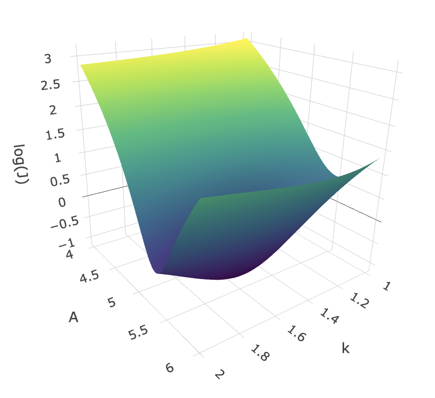
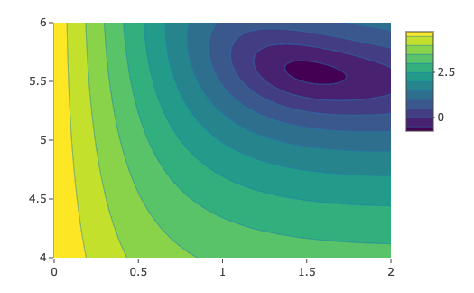
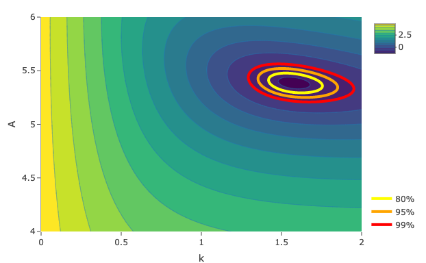
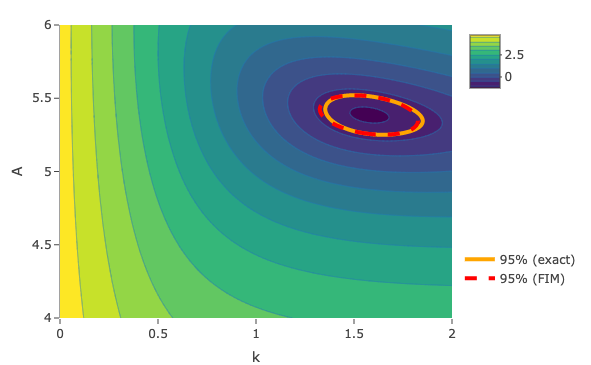

## Quality of estimation

- Apart from obtaining parameter estimates, we want to know a measure of uncertainty for these values.

- Main idea: use objective function $J(\theta)$ to quantify uncertainty.
  - High curvature: low uncertainty (parameters well determined)
  - Low curvature: high uncertainty (not well determined)

```{r, echo=FALSE}
library(plot3D)

x <- outer(seq(-7, 7, length.out = 50), rep(1, 50))
y <- outer(rep(1, 50), seq(-7, 7, length.out = 50))
z1 <- x^2 + y^2
z2 <- 0.5*x^2 + 0.1*y^2

par(mfrow=c(1, 2))
surf3D(x, y, z1, colkey = FALSE)
surf3D(x, y, z2, colkey = FALSE)

```

## Synthetic data

Model: logistic curve
\[
  y = \frac{A}{1 + \exp(k(x_\text{mid} - x))} + \epsilon,
\]
where $\epsilon \sim N(0, \sigma^2)$. 

- Parameters: $A = 5.6$, $k = 1.4$, $x_\text{mid} = 2.5$.
- Measurement noise: $\sigma = 0.2$ (the measure).

We take $n = 20$ data points from this model:

```{r, echo=FALSE, out.height='33%', fig.align='center'}
set.seed(1234)
thetas <- c(5.6, 1.4, 2.5)
measurement_sd <- 0.2

model <- function(xdata, thetas) {
  thetas[[1]] / (1 + exp(thetas[[2]] * (thetas[[3]] - xdata)))
}

n <- 20
xdata <- seq(-3, 9, length.out = n) + rnorm(n, sd = 0.5)
ydata <- model(xdata, thetas) + rnorm(n, sd = measurement_sd)

par(cex = 2)
plot(xdata, ydata, pch = 19, xlab = "", ylab = "")

```


## Measurement variance

- Typically measurement variance is not known.
- If model well-fitted: estimate from residuals:
\[
  \sigma^2 \approx \frac{J(\theta_\text{best})}{N - p}.
\]
- Here $\sigma^2 \approx 0.523/17 = 0.031$ (true value $\sigma = 0.2^2 = 0.04$)

\vspace*{0.5cm}
```{r, echo=FALSE, out.height='50%', fig.align='center'}
J <- function(thetas, xdata, ydata) {
  resids <- ydata - model(xdata, thetas)
  return(sum(resids^2))
}

fit <- optim(c(5, 1, 2), J, method = "L-BFGS",
             xdata = xdata, ydata = ydata)
thetas_optim <- fit$par

par(mfrow=c(1, 2))
xplot <- seq(min(xdata), max(xdata), length.out = 50)
yplot_optim <- model(xplot, thetas_optim)

par(cex = 1.5)
plot(xdata, ydata, pch = 19, xlab = "X", ylab = "Y")
lines(xplot, yplot_optim, lty = 1)

par(cex = 1.5)
resids <- ydata - model(xdata, thetas_optim)
plot(ydata, resids, pch = 19, xlab = "Y", ylab = "Residuals")
abline(h = 0, lty = "dashed")
```

## The loss surface

- Surface obtained by plotting $J(\theta)$ for all $\theta$ in some range.
- Optimal parameters are minima on this surface.
- When more than 2 parameters: focus on subset of parameters.
- **For visualization only.** (Higher dimensions: calculus)

:::::: {.cols data-latex=""}
::: {.col data-latex="{0.48\textwidth}"}

:::

::: {.col data-latex="{0.05\textwidth}"}
\mbox{}
:::

::: {.col data-latex="{0.48\textwidth}"}

:::
::::::

## Exact confidence region

Confidence region: all $\theta$ such that
\[
  J(\theta) \le \left(1 + \frac{p}{N-p}F_{p,N-p,1-\alpha} \right) \times J(\theta_\text{best}),
\]
where $F_{p,N-p,1-\alpha}$ is quantile from $F$-distribution, $\alpha$ is significance level.

- Reasonably exact for models that are not too nonlinear.
- Easy to calculate numerically
- **Hard to describe or use explicitly**

## Exact confidence region

{fig-align='center'}

## Approximate confidence region

Taylor expansion to second order:
\begin{multline*}
  J(\theta) \approx 
    J(\theta_\text{best}) + 
    \sum_{i = 1}^N \underbrace{\frac{\partial J}{\partial \theta_i}(\theta_\text{best})}_{= 0}(\theta - \theta_\text{best})_i + \\
    \frac{1}{2} \sum_{i,j=1}^N \frac{\partial^2 J}{\partial \theta_i \partial \theta_j}
      (\theta - \theta_\text{best})_i(\theta - \theta_\text{best})_j.
\end{multline*}

Confidence region becomes
\[
  (\theta - \theta_\text{best})^T \mathcal{I} (\theta - \theta_\text{best}) \le p F_{p, N-p, 1-\alpha}.
\]
with $\mathcal{I}$ the **Fisher Information Matrix (FIM)**:
\[
  \mathcal{I}_{ij} = 
    \frac{1}{\sigma^2} \sum_{k = 1}^N \left(
    \frac{\partial y}{\partial \theta_i}(x_k, \theta_\text{best})
    \frac{\partial y}{\partial \theta_j}(x_k, \theta_\text{best}) \right).
\]

## Interpretation of the FIM

- The FIM tells us how much information the data give us about the model parameters.

- Alternatively, the FIM contains two ingredients:
  - The **sensitivity functions**, given by
  \[
    s_i(x, \theta) = \frac{\partial y}{\partial \theta_i}.
  \]
  Variables that are sensitive to perturbations in a parameter contain a lot of information about that parameter, and will contribute a lot to the FIM (and vice versa).
  - The **measurement noise** $\sigma^2$. Measurements with lots of noise contain less information about the parameters.

## Approximate confidence region

- Level sets of quadratic approximation are ellipsoids.
- Good approximation to exact confidence region close to optimum.

{fig-align='center'}


## Variance/covariance of parameters

- Often, we want to know variance of individual parameters and covariance between parameters.
- Encoded in the error covariance matrix:
\[
  C = \begin{bmatrix}
      \sigma^2_{\theta_1} & \text{cov}(\theta_1,\theta_2) & \cdots & \text{cov}(\theta_1,\theta_p) \\
      \text{cov}(\theta_2,\theta_1) & \sigma^2_{\theta_2} & \cdots & \text{cov}(\theta_2,\theta_p) \\
      \vdots & \vdots & \ddots & \vdots \\
      \text{cov}(\theta_p,\theta_1) & \text{cov}(\theta_p,\theta_2) & \cdots & \sigma^2_{\theta_p}
  \end{bmatrix}.
\]

- Diagonal: variances, off-diagonal: covariances
- Can be used to construct correlations between between parameters:
\[
  R_{ij} = \frac{\text{cov}(\theta_i, \theta_j)}{\sigma_{\theta_i} \sigma_{\theta_j}}.
\]


## Computing the error covariance matrix

- The inverse of the FIM $\mathcal{I}$ is a lower bound for $C$:
\[
  C \ge \mathcal{I}^{-1}.
\]
- **This is not an obvious result.**

- Approximate confidence interval for parameter $\theta_i$:
\[
  (\theta_\text{best})_i \pm t_{N-p, 1-\alpha/2} \sqrt{C_{ii}}.
\]

## Bootstrap confidence intervals