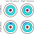
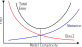

```{r}
library(tidyverse)
library(gridExtra)

theme_set(theme_bw() + theme(text = element_text(size = 14)))
```


# Model Selection

## Model selection

- Also called _structure characterisation_
- Problem: "perfect" model and "true" parameters are unknown.
- Goal:  __Select best model structure from set of candidate models, based on experimental data__

## Which model fits the data the best?

- True model: $y = \sin(x) + \sqrt{x} + 0.3 \epsilon$, where $\epsilon \sim N(0, 1)$
- Four datasets, fit polynomial of degree 1, 2, or 8

```{r}
#| echo: false
#| fig-height: 6
set.seed(1234)

# True model
true_model <- function(x) {
  sin(x) + sqrt(x)
}

# Sample data from true model + noise
n <- 100
x <- seq(0, 5, length.out = n)
y <- true_model(x) + 0.3*rnorm(n)


# Fit polynomial
run_experiment <- function() {
  ss_mask <- sample(1:length(x), 25)
  x_ss <- x[ss_mask]
  y_ss <- y[ss_mask]
  x_rest <- x[-ss_mask]
  y_rest <- y[-ss_mask]
  
  plot(x_ss, y_ss, pch=19, col=1, xlim=c(0, 3), ylim=c(-0.4, 3.1), 
       axes=FALSE, frame.plot=TRUE, xlab="", ylab="")
  
  fit_model <- function(n, col) {
    if (n > 0) {
      m <- lm(y_ss ~ poly(x_ss, n, raw=TRUE))
    } else {
      m <- lm(y_ss ~ 1)
    }
    x_plot <- seq(min(x), max(x), length.out = 100)
    y_plot <- predict(m, data.frame(x_ss=x_plot))
    lines(x_plot, y_plot, col = col, lwd = 2)
  }
    
  fit_model(1, col = 3)
  fit_model(2, col = 4)
  fit_model(8, col = 6)
  legend(2, 1, legend = c("Deg. 1", "Deg. 2", "Deg. 8"),
         col = c(3, 4, 6), lwd = 2)
}

# Run 4 experiments
par(mfrow = c(2, 2), mar = c(0.5, 0.5, 0.5, 0.5))
x <- replicate(4, run_experiment())

```

## Two sources of error

:::: {.columns}

::: {.column width="50%"}


**Bias**: *How well does the model fit the data?*

- Error due to non-modeled phenomena.
- Decreases as model gets more complex.

\vspace*{0.5cm}
**Variance**: *How much does the fitted model change across training sets?*

- Decreases with more data.
- Increases as model gets more complex.

:::

::: {.column width="40%"}



:::

::::

## The bias-variance tradeoff

Goal of model selection: select model with smallest total error = compromise between bias error and variance error

{fig-align="center"}


## Model selection for linear models

- Same polynomial data as explained before
- Polynomial model $y \sim 1 + x + x^2 + \cdots + x^d$

```{r}
#| echo: false
#| out-width: 3in
#| out-height: 1.5in
#| fig-width: 4.5
#| fig-height: 2
#| fig-align: center

source("scripts/03a-parameter-estimation/bias-variance-curves.R", local = knitr::knit_global())

poly_bias_variance
```

- Model of degree 2 (quadratic curve) gives best fit (not too complex, not too simple)
- Bias and variance are in general **difficult to calculate**

# Methods for model selection

## Methods for model selection

- _A priori_ model selection: before parameter estimation
    - Reduces number of parameter estimations necessary = time gain
    - Techniques not easy to determine: ad hoc methods
- _A posteriori_ model selection: after parameter estimation
    - General methods available 
    - Need parameter estimation for all candidate models = increase in calculation times

## A priori model selection

- Restrict set of model candidates based on properties of data that are independent of parameters.
- Biodegradation example: candidate curves have either zero or one inflection point, enough to rule out some candidates before fitting.

```{r}
#| echo: false
#| fig-height: 4
#| out-height: 5in

source("scripts/03a-parameter-estimation/monod-synthetic.R", local = knitr::knit_global())

run_all()
```

##  A posteriori model selection

- Compose set of candidate models
- Collect experimental dataset(s)
- Perform parameter estimation for all models
- Rank candidate models and select best
- Methods
    - Information criteria
    - Statistical hypothesis test
    - Residual analysis

::: {.callout-warning}
Statistical tests, information criteria, etc only yield reliable results if model is **well fit** (residuals are independent and normally distributed)
:::

## Information criteria

Select least complex model that describes data (sufficiently) well.

Balance two terms:

1. **Goodness of fit**, measured by sum of the squared residuals (SSR)
2. **Complexity of the model**, as a function of number of parameters.

We will see two criteria to compare models:

- AIC: which model would predict best on new data?
- BIC: which model is most likely to be the true one?

Information criteria may contradict one another.

## Akaike Information Criterion (AIC)

Model complexity penalty: $2p$, with $p$ number of parameters:
$$
  AIC = N \ln\left( \frac{SSR}{N} \right) + 2p.
$$
Properties:

- Favors prediction accuracy.
- Not necessarily consistent (will not select true model even if sample size is large).


## Bayes Information Criterion (BIC)

Model complexity penalty: $p \ln N$
$$
  BIC = N \ln\left( \frac{SSR}{N} \right) + p \ln N.
$$
Properties:

- Selects a simpler model than AIC.
- Consistent (under some conditions).

## AIC/BIC: Polynomial example

- SSR always decreases as the number of parameters increases
- Penalty terms keep growing — combining the two gives a U-shape (next slide)

Example: Select best linear model $y \sim 1 + x + \cdots + x^d$ according to AIC/BIC for given data.

```{r}
#| echo: false
#| out-width: 4.5in
#| out-height: 2in
#| fig-width: 7
#| fig-height: 3
#| fig-align: center

set.seed(1234)

# True model
true_model <- function(x) {
  sin(x) + sqrt(x)
}
sample_from_true_model <- function(n) {
  x <- seq(0, 5, length.out = n)
  data.frame(
    x = x,
    y = true_model(x) + 0.3*rnorm(n))
}

train <- sample_from_true_model(25)

fit_model <- function(degree, data) {
  if (degree > 0) {
    m <- lm(y ~ poly(x, degree, raw = TRUE), data = data)
  } else {
    m <- lm(y ~ 1, data = data)
  }
  m
}

eval_model <- function(model, data) {
  resid <- data$y - predict(model, newdata = data)
  sum(resid^2)
}

fit_and_eval <- function(degree) {
  n <- nrow(train)
  model <- fit_model(degree, train)
  SSR = eval_model(model, train)
  data.frame(
    degree = degree,
    SSR = SSR,
    AIC_penalty = 2 * degree,
    BIC_penalty = degree * log(n))
}

degrees <- 0:6
plot_data <- degrees |>
  map(fit_and_eval) |>
  bind_rows()

p_ssr <- 
  ggplot(plot_data, aes(x = degree, y = SSR)) +
  geom_line() +
  geom_point() +
  xlab("Degree") + ylab(NULL) +
  ggtitle("Sum of squared residuals") 
  

plot_data_penalty <- plot_data |>
  select(degree, AIC_penalty, BIC_penalty) |>
  pivot_longer(!degree)
  
p_penalty <- 
  ggplot(plot_data_penalty, aes(x = degree, y = value, color = name)) +
  geom_line() + 
  geom_point() +
  xlab("Degree") +
  ylab(NULL) +
  ggtitle("Complexity penalty")

grid.arrange(p_ssr, p_penalty, ncol = 2)

```


## AIC/BIC: Polynomial example

Optimal model provides a **good fit** (SSR low) and is **not too complex** (penalty low).

```{r}
#| echo: false
#| out-width: 4.5in
#| out-height: 2in
#| fig-width: 7
#| fig-height: 3
#| fig-align: center

fit_and_eval <- function(degree) {
  n <- nrow(train)
  model <- fit_model(degree, train)
  SSR = eval_model(model, train)
  data.frame(
    degree = degree,
    AIC = n * log(SSR / n) + 2 * degree,
    BIC = n * log(SSR / n) + degree * log(n))
}

degrees <- 0:6
plot_data <- degrees |>
  map(fit_and_eval) |>
  bind_rows() |>
  pivot_longer(!degree)

# Plot of AIC/BIC against degree
p <- ggplot(plot_data, aes(x = degree, y = value, color = name)) +
  geom_point() +
  geom_line() +
  xlab("Degree") +
  ylab(NULL) +
  ggtitle("AIC/BIC") +
  theme(legend.title=element_blank()) +
  scale_x_continuous(breaks = degrees)

# Plot of data with best fit (degree 3)
model3 <- fit_model(3, train)
predict3 <- function(x) {
  predict(model3, newdata = data.frame(x = x))
}
q <- ggplot(train) +
  geom_point(aes(x = x, y = y)) +
  geom_function(fun = predict3) +
  ggtitle("Optimal fit")

grid.arrange(p, q, ncol = 2)
```

- Both AIC and BIC select the fit of degree 3
- In general AIC and BIC don't have to agree


## Statistical hypothesis test

- Choice between 2 **nested** models: simple and more complex
- Is the complex model statistically speaking better?
- Verify using F-test:
$$
F = \dfrac{ \dfrac{SSR_{simple}-SSR_{complex}}{p_{complex}-p_{simple}}}{\dfrac{SSR_{complex}}{N-p_{complex}}}
$$
- Compare $F$ with tabulated $F_{1-\alpha,p_{complex}-p_{simple},N-p_{complex}}$ for significance level $\alpha$
- If $F$ exceeds the critical value, prefer the complex model; otherwise, prefer the simple one
- Requires normally distributed residuals

## Residual analysis

- Hypothesis: model is appropriate if properties of residuals are same as properties of measurement errors
- Two popular techniques for evaluating independence of residuals
    - Autocorrelation test (see Parameter Estimation)
    - Runs test (nonparametric test)

# Case study: biodegradation data


## Waste biodegradation

**Waste treatment**: Measure the oxygen uptake rate (OUR) during oxidation of biodegradable waste products by activated sludge.
    
- Shape respirogram depends on degradation kinetics and quantity of added products
- Not known a priori $\rightarrow$ measure and test several models

```{r}
#| echo: false
#| out-height: 5in
#| fig-height: 4
our.data <- read.csv("datasets/03-parameter-estimation/vanrolleghem_our.csv")
plot(our.data[,1], our.data[,2], 
     ylim = c(0, 1), pch = 20,
     xlab = "Time", ylab = "OUR")
```

## General model

- $k$ pollutants $S_1, \ldots, S_k$.

- Oxygen uptake rate
$$
OUR = \sum_{i=1}^k (1-Y_i)r_{S_i}
$$
where $Y_i$ is the yield (fraction of substrate $S_i$ that is not oxidized but transformed in biomass $X$), and $r_{S_i}$ the degradation rate of $S_i$.

- Candidate models differ in number of pollutants $k$ and choice of degradation rates $r_{S_i}$.

## Candidate models

**Model 1**: degradation of one pollutant according to first-order kinetics. Gives *exponentially* decreasing OUR-curve.
\begin{align*}
  r_{S_1} & = \dfrac{k_{max1}X}{Y_1}S_1 \\
  OUR & = (1-Y_1)r_{S_1}
\end{align*}

## Candidate models

**Model 2**: degradation of one pollutant according to *Monod kinetics*. 
\begin{align*}
  r_{S_1} & = \dfrac{\mu_{max1}X}{Y_1}\dfrac{S_1}{K_{S_1}+S_1} \\
  OUR & = (1-Y_1)r_{S_1}
\end{align*}

## Candidate models

**Model 3**: simultaneous degradation of two pollutants according to Monod kinetics (*double Monod*) without interaction. 
\begin{align*}
  r_{S_1} & = \dfrac{\mu_{max1}X}{Y_1}\dfrac{S_1}{K_{S_1}+S_1} \\
  r_{S_2} & = \dfrac{\mu_{max2}X}{Y_2}\dfrac{S_2}{K_{S_2}+S_2} \\
  OUR & = (1-Y_1)r_{S_1}+(1-Y_2)r_{S_2}
\end{align*}

## Parameter estimation

Dataset (dots) and best fits (calibrated candidate models based on an SSR-based objective function) of the different models

```{r}
#| echo: false
#| fig-width: 7
#| fig-height: 4
source("scripts/03a-parameter-estimation/monod-plot.R", local = knitr::knit_global())

run_all()
```

## AIC/BIC/F-test

```{r}
#| echo: false
source("scripts/03a-parameter-estimation/monod-plot.R", local = knitr::knit_global())

bind_rows(
  model_eval_first_order(),
  model_eval_single_monod(),
  model_eval_double_monod()
) |>
  mutate(Model = c("Exponential", "Single Monod", "Double Monod"),
         .before = 1) |>
  knitr::kable(digits = 2, align = "lrrrr")
```

## Residuals as a function of time

```{r}
#| include: false
source("scripts/03a-parameter-estimation/monod-residuals.R", local = knitr::knit_global())
```

```{r}
#| echo: false
#| fig-width: 7
#| fig-height: 4
plot.residuals()
```

## Autocorrelations

```{r}
#| echo: false
#| fig-width: 7
#| fig-height: 4
plot.acf()
```

- Residuals show some correlation for all three models, indicating that there is some unresolved structure in the data.
- Correlations for double Monod decay much quicker than the other two models.
