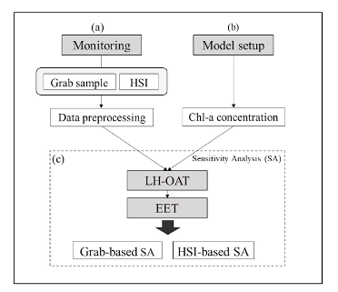
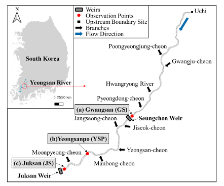
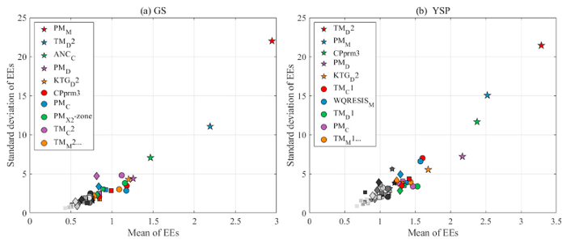
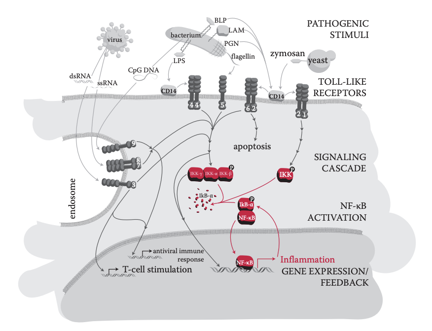
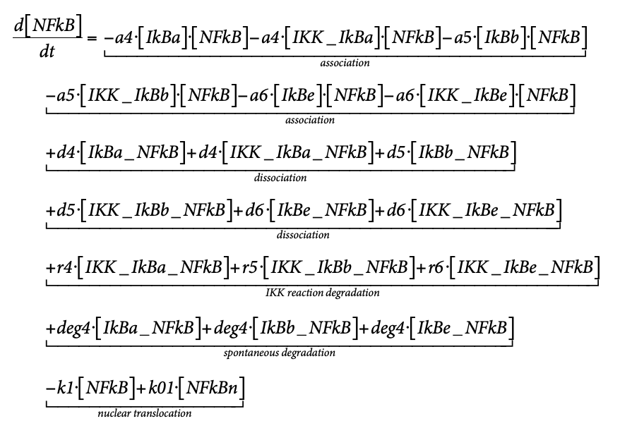
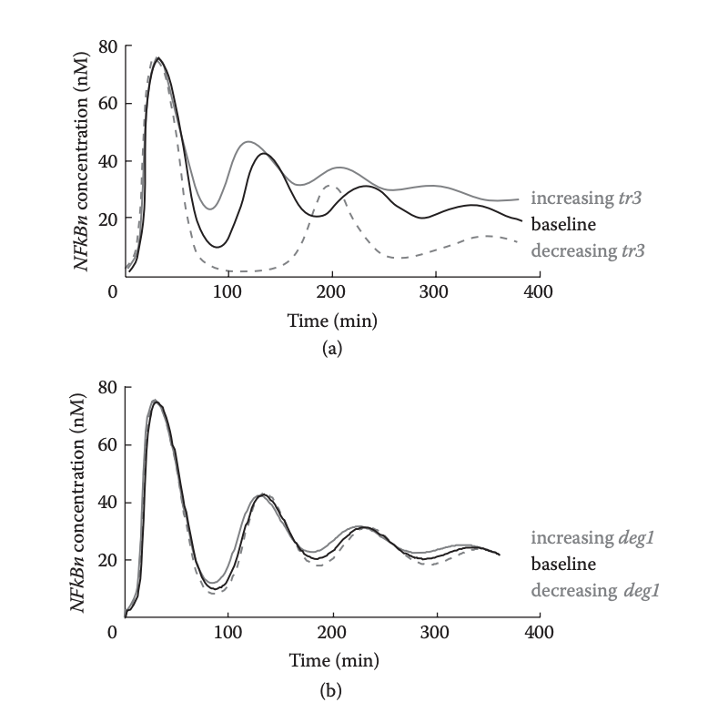
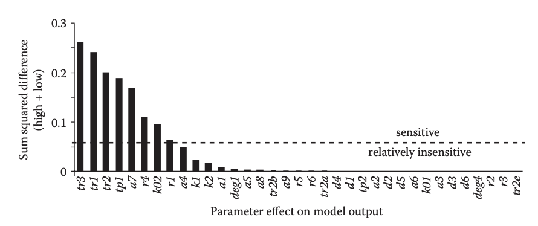
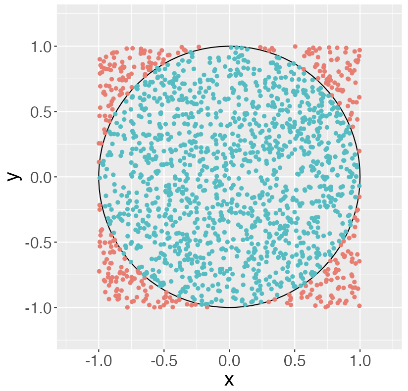
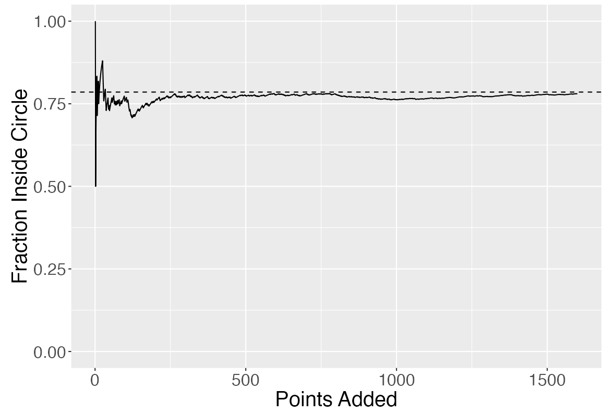

# Sensitivity Analysis

## Why sensitivity analysis?

- Verify what _sources of uncertainty_ contribute most to variance (uncertainty) of model output.
- Sources of uncertainty in model can be
    - Model parameters, initial conditions, inputs
    - Model structure
- Better understand changes in model predictions due to the above

## Why sensitivity analysis?

- Detect what _model parameters_ contribute most to model output uncertainty 
- Want to reduce model uncertainty, so best to focus on most influential parameters 
- Gives idea of correlation between parameters 
- Helps in choice of what parameters to estimate (in parameter estimation)

## Why sensitivity analysis?

- Gives information about interesting location, time, ... to collect experimental data
- Basis for experimental design
- Gives information on insensitive model parameters
- Useful in model reduction of overparametrized models

## Local vs global

1. Local sensitivity analysis
    - Determine sensitivity at **one certain point** in parameter space
    - Not very computationally intensive
    \newline
2. Global sensitivity analysis
    - Determine sensitivity in **delimited area** of parameter space
    - Usually gives a mean sensitivity
    - Can become extremely computationally intensive

- Each technique has advantages and disadvantages
- Each technique gives different type of information
    
## Examples of sensitivity analysis: water quality model

::::::: {.cols data-latex=""}
::: {.col data-latex="{0.55\textwidth}"}

- Hundreds of parameters
- Each model simulation takes days to run
- Identifying highly sensitive parameters is critical

{width=75% align="center"}
:::

::: {.col data-latex="{0.05\textwidth}"}
\mbox{}
:::
::: {.col data-latex="{0.55\textwidth}"}

{width=75%}
{width=75%}

:::
::::::

\scriptsize
Source: *Developing a cloud-based toolbox for sensitivity analysis of a water quality model* (S. Kim et al, Environmental Modeling and Software, 2021)

## Examples of sensitivity analysis: cell signaling

Toll-like signaling pathway:

- Cellular response to external stimuli (e.g. infection)
- Central role for NF-$\kappa$B transcription factor
- Shuttles back and forth between cytoplasm and nucleus

\centering
{width=60%}

\scriptsize    
Source: Images from _Fundamentals of Systems Biology_, M. Covert, CRC Press, 2014.

## Examples of sensitivity analysis: cell signaling

Hoffmann-Levchenko (2005): Computational model for NF-$\kappa$B

::::::: {.cols data-latex=""}
::: {.col data-latex="{0.48\textwidth}"}

- 25 ODEs, 36 parameters
- Models protein production, degradation, transport
- Important role for **parameter estimation** and **sensitivity analysis**

:::

::: {.col data-latex="{0.05\textwidth}"}
\mbox{}
:::

::: {.col data-latex="{0.48\textwidth}"}

:::
::::::

\scriptsize    
Source: Images from _Fundamentals of Systems Biology_, M. Covert, CRC Press, 2014.

## Examples of sensitivity analysis: cell signaling

Sensitivity analysis: which parameters affect the model the most?

- Transcription rate: affects output a lot (**sensitive**)
- Degradation rate: relatively **insensitive**

Gives rough idea, needs to be corroborated with full model.

::::::: {.cols data-latex=""}
::: {.col data-latex="{0.48\textwidth}"}
{width=90%}
:::

::: {.col data-latex="{0.05\textwidth}"}
\mbox{}
:::

::: {.col data-latex="{0.48\textwidth}"}

:::
::::::

\scriptsize    
Source: Images from _Fundamentals of Systems Biology_, M. Covert, CRC Press, 2014.

    
# Local sensitivity analysis    

## Local sensitivity analysis

- How sensitive is model output ($y$) to changes of model parameter ($\theta$) at one single point in parameter space
- Mathematically: partial derivative of variable to parameter (_absolute sensitivity_, 1 number) at single point in parameter space
$$\frac{\partial y}{\partial \theta}$$
- Dynamical models: $y$ varies over time, hence also sensitivity varies over time $\rightarrow$ _(absolute) sensitivity function_ 
$$\frac{\partial y(t)}{\partial \theta}=S(t)$$
- For a single output, sensitivity functions for each individual parameter $\theta_j$ can be determined

## Local sensitivity analysis: absolute sensitivity

- Often $y(t)$ can only be numerically determined, then also $S(t)$
- Finite difference method: \alert{forward difference}
\[
\left.\frac{\Delta y(t)}{\Delta \theta_j}\right|_+  
  =  \frac{y(t,\theta_j+\Delta\theta_j)-y(t,\theta_j)}{\Delta\theta_j}
\]

- Finite difference method: \alert{backward difference}
\[
\left.\frac{\Delta y(t)}{\Delta \theta_j}\right|_-  
  = \frac{y(t,\theta_j)-y(t,\theta_j-\Delta\theta_j)}{\Delta\theta_j}
\]

## Local sensitivity analysis: absolute sensitivity

- How to choose perturbation $\Delta\theta_j$?
  - Too large: approximation is not good
  - Too small: numerical instabilities will set in.
- In practice, choose $\Delta \theta_j$ \alert{small} and \alert{fixed}, e.g.
\[
   \Delta \theta_j = 10^{-6}.
\]

\begin{exampleblock}{Convergence}
  Both the forward and the backward difference agree with the derivative up to
  order $\Delta \theta_j$:
  \[
  \frac{\partial y(t)}{\partial \theta_j} = 
    \left.\frac{\Delta y(t)}{\Delta \theta_j}\right|_+
    + \mathcal{O}(\Delta \theta_j), \quad
  \frac{\partial y(t)}{\partial \theta_j} = 
    \left.\frac{\Delta y(t)}{\Delta \theta_j}\right|_-  
    + \mathcal{O}(\Delta \theta_j).
  \]
\end{exampleblock}

## Local sensitivity analysis: absolute sensitivity

- Finite difference method: \alert{central difference}
\[
\frac{\Delta y(t)}{\Delta \theta_j} =   
    \frac{y(t,\theta_j+\Delta\theta_j) - y(t,\theta_j-\Delta\theta_j)}{2\Delta\theta_j}
\]

\begin{exampleblock}{Convergence}
  The central difference agrees with the derivative up to
  order $(\Delta \theta_j)^2$:
  \[
  \frac{\partial y(t)}{\partial \theta_j} = 
    \frac{\Delta y(t)}{\Delta \theta_j}
    + \mathcal{O}((\Delta \theta_j)^2).
  \]
\end{exampleblock}

## Local sensitivity analysis: relative sensitivity

- Want to compare sensitivities of different combinations of outputs and parameters 
\newline
- Absolute sensitivity is influenced by magnitude of variable/parameter
\newline
- Use **relative sensitivity**

## Local sensitivity analysis: relative sensitivity

- Relative sensitivity w.r.t. parameter $\dfrac{\partial y(t)}{\partial \theta_j} \cdot \theta_j$ \newline
Compare sensitivity of _same variable_ w.r.t. _different parameters_
\newline
- Relative sensitivity w.r.t. variable $\dfrac{\partial y_i(t)}{\partial \theta} \cdot \dfrac{1}{y_i}$ \newline
Compare sensitivity of _different variables_ w.r.t. _same parameter_
\newline
- Total relative sensitivity $\dfrac{\partial y_i(t)}{\partial \theta_j} \cdot \dfrac{\theta_j}{y_i}$ \newline
Compare all sensitivities, i.e., relative w.r.t. parameter and variable

## Local sensitivity analysis

- Relative sensitivities allow to __rank sensitivities__
    - Choice parameters for parameter estimation
    - Choice parameters for model reduction
    - Choice for additional measurement or experimental determination of parameter (reduce sources of uncertainty)
- Ranking __depends on nominal value of parameter__, can be different at different position in parameter space
- How to compare continuous sensitivity functions?
- Interest in specific time points
    - Where measurements are available
    - Where measurements will be collected
    
## Local sensitivity analysis

- Create generic model with
    - Outputs $y_i$, $i=1,\ldots,v$
    - Parameters $\theta_j$, $j=1,\ldots,p$
    - Moments of measurements $t_k$, $k=1,\ldots,N$
- Total relative sensitivity of variable $y_i$ w.r.t. parameter $\theta_j$ at moment $t_k$
$$
S_{i,j,k}=\dfrac{\partial y_i(t_k)}{\partial \theta_j} \cdot \dfrac{\theta_j}{y_i}
$$

## Local sensitivity analysis

Importance parameter is determined by its impact on _all_ variables \newline
$\rightarrow$ sum and average over all variables \newline
$\rightarrow$ take sign into account (square and root)\newline
__root mean square sensitivity for parameter__ $\theta_j$
$$
\delta_{j,k}^{rmsq}=\sqrt{\dfrac{\sum_{i=1}^vS_{i,j,k}^2}{v}}
$$
\ \newline
$\delta_{j,k}^{rmsq}$ can be very variable from moment to moment \newline
$\rightarrow$ sum and average over all time points\newline
__time mean root mean square sensitivity for parameter__ $\theta_j$
$$
\delta_j^{rmsq} = \dfrac{1}{N}\sum_{k=1}^N \delta_{j,k}^{rmsq}
$$

## Local sensitivity analysis

- Gives one single measure for sensitivity of parameter
- Use this measure to determine importance of parameter
- Obtained value depends on
    - nominal parameter value: nonlinear models give different values at different location in parameter space (see also global sensitivity analysis)
    - choice of time points is arbitrary: this can lead to different set of parameters that are best estimated using dataset (see also identifiability)
- Modifications can be defined based on application/goal

# Side track: Monte Carlo simulation

## Monte Carlo simulation technique

::::::: {.cols data-latex=""}
::: {.col data-latex="{0.65\textwidth}"}

- Computational algorithm, based on 
  - Large number of simulations (thousands to millions)
  - Repeated random sampling
- Used for modeling of
  - Climate and environment
  - Nuclear reactions
  - Financial systems
  - Molecular dynamics
  - ...
- In this course:
  - Global sensitivity analysis
  - Uncertainty analysis
    
:::

::: {.col data-latex="{0.05\textwidth}"}
\mbox{}
:::
::: {.col data-latex="{0.32\textwidth}"}

:::
::::::
    
## Example: computing $\pi$

- Drop points uniformly at random in the square $[-1, 1] \times [-1, 1]$
- Count fraction for which $x^2 + y^2 < 1$
- As $N \to \infty$, gives approximation for $\pi/4$.

::::::: {.cols data-latex=""}
::: {.col data-latex="{0.38\textwidth}"}

:::

::: {.col data-latex="{0.05\textwidth}"}
\mbox{}
:::

::: {.col data-latex="{0.58\textwidth}"}

:::
::::::

App available at [https://shiny-stats.fly.dev/monte-carlo/](https://shiny-stats.fly.dev/monte-carlo/).

## Monte Carlo simulation technique

Practical problems:

1. Determining PDF for all stochastic components
    - Repeated measures
    - CI of estimated parameter
    - Literature
    - Expert knowledge
2. Requires large number of simulations, computationally intensive (especially if model complex)

# Global sensitivity analysis (GSA)

## Global sensitivity analysis (GSA)

- Measure for sensitivity on delimited area in parameter space
- PDFs for parameters need to be chosen/found (same as for uncertainty analysis)

\ \newline

3 techniques will be discussed:

- Standardized regression coefficients
- Screening techniques
- Variance decomposition

## GSA: Standardized regression coefficients

- Linear regression of Monte Carlo simulations
- Each line is simulation of variable $y$ for different parameter set $\Theta$, i.e., other point in parameter space

\begin{figure}
\includegraphics[width=.6\textwidth]{images/temp/051.pdf}
\end{figure}

## GSA: Standardized regression coefficients

- Linear regression at certain time point gives
$$Y = \Theta \cdot B + E$$
$$
\left[ \begin{array}{c}
y_1 \\ y_2 \\ \vdots \\ y_n
\end{array} \right] = 
\left[ \begin{array}{ccccc}
1 & \theta_{11} & \theta_{12} & \ldots & \theta_{1p} \\ 
1 & \theta_{21} & \theta_{22} & \ldots & \theta_{2p} \\ 
\vdots & \vdots & \vdots & & \vdots \\
1 & \theta_{n1} & \theta_{n2} & \ldots & \theta_{np} 
\end{array} \right] \
\left[ \begin{array}{c}
b_0 \\ b_1 \\ \vdots \\ b_p
\end{array} \right] +
\left[ \begin{array}{c}
\epsilon_1 \\ \epsilon_2 \\ \vdots \\ \epsilon_n
\end{array} \right]
$$

- Solve to $b_i$ by minimizing $E^2=(Y-\Theta\cdot B)^2$
- $b_i$ gives respective contribution of parameter $\theta_i$ in explaining variance of $y$

## GSA: Standardized regression coefficients

- Correct for spread on both parameter and output
- Recalculate elements of $B$ to $SRC$s
$$
SRC_{\theta_i} = b_i \cdot \dfrac{\sigma_{\theta_i}}{\sigma_y}
$$
- Standard deviations from 
    - vector $Y$ for output
    - resp. $2^{nd}$ to $(p+1)^{st}$ column of matrix $\Theta$ for different parameters

## GSA: Standardized regression coefficients

- For linear model in parameters that were examined, the total variance is explained by $SRC$s
$$\sum_i SRC_{\theta_i}^2=1$$
- For nonlinear models (in the parameters) _not_ all variance will be explained. The part that is explained is given by determination coefficient
$$R^2=\sum_{i=1}^n \dfrac{(\hat{y}_i-\overline{y})^2}{(y_i-\overline{y})^2}$$
- $\hat{y}_i$: prediction by regression model
- Technique only valid if $R^2 > 0.7$

## GSA: Screening techniques

- Goal: obtain idea of importance of model parameters using only a limited number of simulations
- Example of technique: Morris screening
- Calculation of _elementary effect_ for $\theta_i$
$$EE_{\theta_i} = \dfrac{y(\theta_i+\Delta)-y(\theta)}{\Delta}$$
- $\Delta$ is a predetermined step size in parameter
- Remark analogy with local sensitivity, however, step size much larger

## GSA: Morris screening

- Assume 2 parameters $\theta_1$ and $\theta_2$
- Locations in parameters space chosen systematically

\begin{figure}
\includegraphics[width=.7\textwidth]{images/temp/052.pdf}
\end{figure}

## GSA: Morris screening

- Vector of $EE$ (in this case 4)
- Statistical analysis of this vector
    - $\mu_{EE_{\theta_i}}$: indication on average effect of this parameter over entire parameter space; large value means important parameter and vice versa
    - $\sigma_{EE_{\theta_i}}$: information about linear behaviour of parameter; large value means nonlinear parameter or parameter involved in interactions with other parameters
- Do same for $\theta_2$

## GSA: Morris screening

- Normally 2 simulations needed per $EE$
- 1991: Morris introduced more efficient way

\begin{figure}
\includegraphics[width=.7\textwidth]{images/temp/053.pdf}
\end{figure}

- Number of simulations: 
\begin{center}
(number $EE$ per parameter)$\cdot$(number parameters +1)
\end{center}

## GSA: Variance decomposition

- Goal: find share of each model parameter in variance of model output
- Used for models that are strongly nonlinear or nonmonotonous
- Example of model with 3 paramaters:
$$\sigma_y^2=\sigma_1^2+\sigma_2^2+\sigma_3^2+\sigma_{12}^2+\sigma_{13}^2+\sigma_{23}^2+\sigma_{123}^2$$
- Normalisation (i.e., divide by $\sigma_y^2$) gives _sensitivity indices_
$$1=S_1+S_2+S_3+S_{12}+S_{13}+S_{23}+S_{123}$$
\ \newline 

- Indicate which fraction of total variance is determined by certain parameter or parameter combination

## GSA: Variance decomposition

- _Total sensitivity indices_
\begin{eqnarray*}
S_{T1} & = & S_1 + S_{12} + S_{13} + S_{123} \\
S_{T2} & = & S_2 + S_{12} + S_{23} + S_{123} \\
S_{T3} & = & S_3 + S_{13} + S_{23} + S_{123} 
\end{eqnarray*}
- Give total contribution of a certain parameter, including interaction effects
- Watch out: some contributions are counted multiple times, hence sum of all total sensitivity indices is no longer 1

## GSA: Variance decomposition

- Two techniques:
    - FAST (Fourier Amplitude Sensitivity Test): uses Fourier decomposition of model output; can determine first order effects (total effects $\rightarrow$ extendedFAST); computationally intensive ((ten) thousands of simulations)
    - Sobol indices: uses multiple integrals, both first order and higher order effects; computationally expensive; less efficient than FAST
